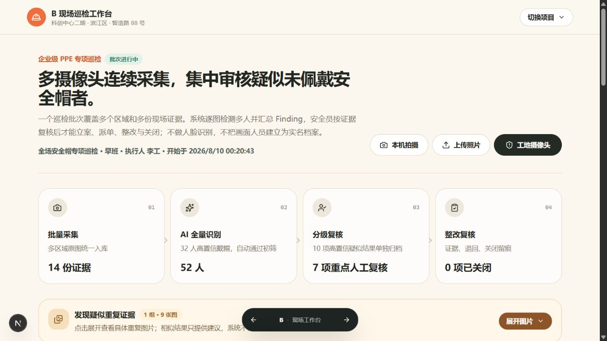

# SiteGuard AI（筑安智巡）

面向工程现场的 AI 安全巡检与隐患整改闭环原型。它不把模型输出直接当成事故或隐患，而是把照片中的可疑情况生成待审核的 `Finding`，交由人员确认后再进入派单、整改、复核和关闭流程。



## 项目解决什么问题

多数视觉识别 Demo 到“检测并画框”就结束了，但工程安全管理还需要明确责任人、整改期限、复核结果和完整审计记录。SiteGuard AI 验证的是一条可落地的小闭环：

```text
照片上传 / 本机拍摄 / 工地摄像头抓拍
                    ↓
       AI 检测画面人员与 PPE 异常
                    ↓
      Finding（待人工确认，不等于隐患）
                    ↓
        确认为隐患 / 驳回 AI 建议
                    ↓
        派发整改 → 提交证据 → 人工复核
                    ↓
              关闭并保留审计记录
```

## 核心功能

- **多来源证据采集**：支持照片上传、本机摄像头拍摄，以及服务端 RTSP 摄像头抓拍。
- **逐人 PPE 审核**：识别一张照片中的多名人员，逐人展示检测框、模型名称和置信度。
- **人工确认优先**：AI 只产生 `Finding`；只有人员确认后才能形成 `HazardCase`（隐患）。
- **完整整改闭环**：覆盖确认、驳回、派单、整改提交、复核通过/退回和关闭。
- **持久化与审计**：内置 SQLite，保存项目、成员、原始证据、检测结果、整改单、复核和审计事件。
- **重复证据治理**：根据采集来源、拍摄时间和图像相似度提示疑似重复，由人员决定是否作废。
- **可替换视觉适配器**：优先调用 Ultralytics YOLOWorld；本地视觉环境不可用时明确回退到 mock 适配器，业务流程仍可演示。
- **三种界面方案**：通过 `variant=A|B|C` 切换驾驶舱原型，其中 B 方案提供最完整的现场巡检工作台。


## 技术架构

| 层次 | 实现 |
| --- | --- |
| Web 与 API | Next.js 16、React 19、TypeScript、Tailwind CSS |
| 领域流程 | Inspection、Finding、HazardCase、RectificationOrder、Verification |
| 数据持久化 | Node.js 内置 SQLite |
| 视觉推理 | Python、Ultralytics、Supervision，可替换 adapter |
| 摄像头接入 | RTSP、MediaMTX（WebRTC/HLS）、FFmpeg 抽帧 |

代码刻意把视觉推理放在 adapter 后面，因此没有安装 Ultralytics 时，领域工作流和界面仍可使用 mock adapter 运行。

## 快速开始

环境要求：Node.js 20+、pnpm 11+。克隆仓库后运行：

```powershell
pnpm install
Copy-Item .env.example .env.local
pnpm dev
```

打开 <http://localhost:3000>，或直接进入功能最完整的 B 方案：

```text
http://localhost:3000/prototype/dashboard?variant=B
```

首次启动会自动创建 `.runtime/siteguard.sqlite` 并写入演示数据，不需要单独安装数据库。恢复初始演示状态：

```powershell
pnpm db:reset
```

### 可选：真实视觉环境

模型权重不进入 Git 历史。下载脚本会把文件放到程序期望的位置，并校验 SHA-256：

```powershell
pnpm weights:download
```

其中：

- `yolov8s-worldv2.pt` 从本项目的 [`model-weights-v1` Release](https://github.com/QIANLING-0831/siteguard-ai/releases/tag/model-weights-v1) 下载，用于实验性的 YOLO-World 开放词汇检测。
- `weights/clip/ViT-B-32.pt` 从 [`openai/CLIP`](https://github.com/openai/CLIP) 官方代码指定的 OpenAI 下载地址获取；它是可选权重，当前重复证据提示使用 dHash，不依赖该权重。

准备 Python 虚拟环境与依赖后，可以检查视觉运行时：

```powershell
pnpm vision:check
```

YOLO-World/Ultralytics 权重与软件受其各自许可证约束；用于商业或闭源场景前，请自行核对上游许可。CLIP 权重由 OpenAI 官方公开地址提供。两个下载项都使用上游公布的 SHA-256 校验值验证完整性。

### 可选：工地摄像头

RTSP 凭据只应放在服务端 `.env.local` 与视频网关环境变量中，不能放入 `NEXT_PUBLIC_*` 变量。完整接入说明见 [摄像头架构文档](docs/architecture/camera-ingestion.md)。

```powershell
pnpm camera:gateway:setup
pnpm camera:gateway
```

## 验证

```powershell
pnpm lint
pnpm build
pnpm check:b-workflow
pnpm check:database-workflow
```

两组工作流检查需要先启动本地网站。

## 演示数据与产品边界

- 演示批次包含 6 份现场证据、52 名画面人员和 17 条待审核 `Finding`。
- 仓库中的部分现场图是合成演示证据，仅用于界面与流程测试，不是准确率验证集；图片来源见 [`public/demo/ATTRIBUTION.md`](public/demo/ATTRIBUTION.md)。
- 项目不宣称真实工地识别准确率，也不会自动把 AI 输出确认为隐患。
- 默认通用模型不代表具备可靠的安全帽或反光背心识别能力；生产化前必须重新评估训练数据、误报漏报、隐私、许可证和现场安全责任。
- `ObservedPerson` 只是单份证据里的临时检测区域，不做人脸识别，也不跨照片追踪个人身份。

## 更多文档

- [MVP 范围](docs/product/mvp.md)
- [企业巡检角色与状态流程](docs/product/ppe-inspection-workflow.md)
- [视觉技术选型](docs/research/vision-stack-options.md)
- [视觉适配器架构决策](docs/adr/0001-isolate-vision-inference.md)
