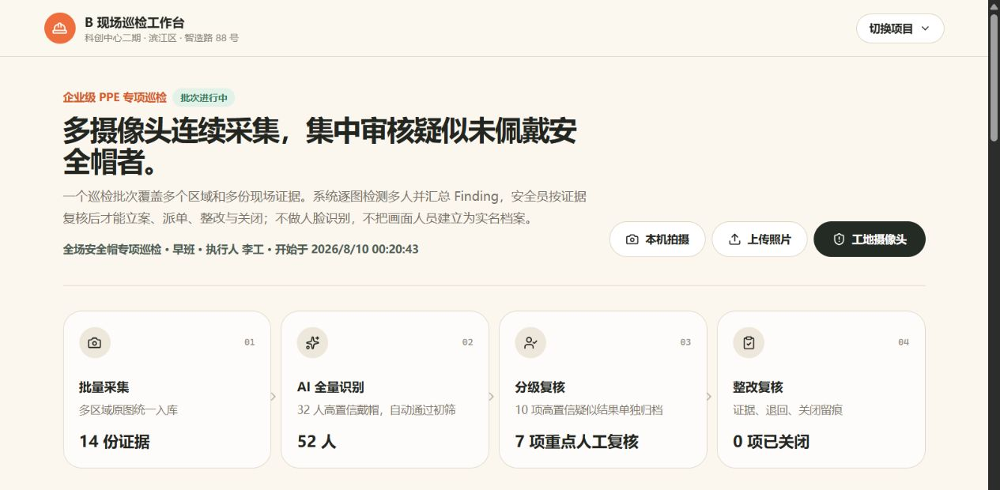
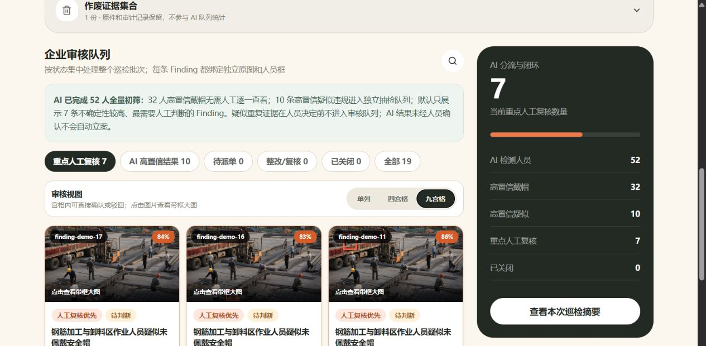
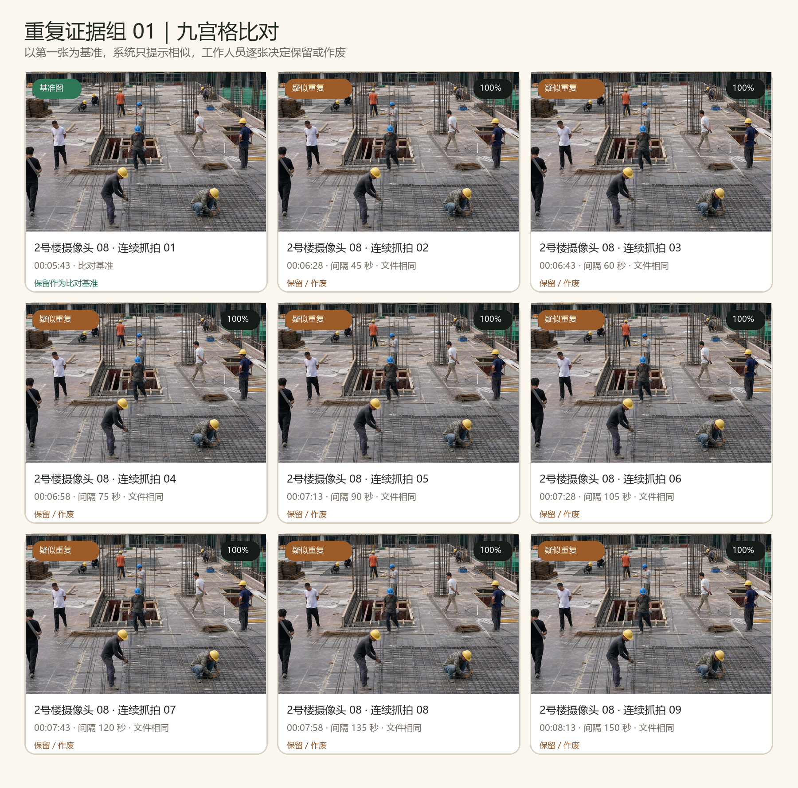

# AI 工地安全巡检：从安全帽识别到证据闭环的产品设计实践

> 摄像头不是终点，识别也不是终点。真正困难的是把现场照片变成可复核、可派单、可追踪的安全管理流程。

**说明：** 本文基于交互原型与合成演示数据。页面中的人数、Finding 数量和置信度仅用于展示工作流，不代表模型准确率或生产部署效果。

## 真正的难题，不是识别，而是流程

很多工地已经安装了摄像头，也积累了大量现场照片。可一旦把问题落到“谁没有佩戴安全帽”这件事上，管理人员仍然要在不同画面之间反复切换：先找人，再判断，再截图，再通知，最后还要确认整改是否完成。照片很多，真正能进入管理流程的证据却很少。

这也是 B 现场巡检工作台想回答的问题：AI 不应该只在图片上画几个框，然后把结果扔给工作人员。它需要进入一条完整、可追溯的业务链路，把采集、识别、人工判断、隐患立案、整改和复核连接起来。

*图 1｜B 现场巡检工作台总览：采集、AI 分流、人工审核与整改复核被放在同一条工作流中。*

## 第一条原则：AI 发现，不等于隐患成立

在工作台里，模型输出被称为 Finding，也就是“发现”。它只是一个尚未被确认的异常观察。只有经过有权限的工作人员查看原图并确认后，它才会升级为 HazardCase，也就是需要跟踪处置的正式隐患。

这个区分看起来像是命名问题，实际上决定了系统的责任边界。模型置信度只能说明模型对某个视觉判断的把握程度，不能替代安全员的专业判断，更不能直接代表风险等级。因此，AI 可以帮人排序、聚合和标记，但不能越过人工确认自动立案。

## 第二条原则：一张照片里的人，要逐个判断

真实工地画面通常不是“一个人、一张图”。一个楼层、材料场或脚手架区域里，可能同时出现十几名工作人员。系统首先检测画面中的人员区域，再对每个人分别判断安全帽状态，并把疑似未佩戴者关联到独立的 Finding。

这里的“画面人员”只是当前证据中的临时检测区域，不是实名档案。原型不做人脸识别，也不跨照片追踪身份。这样既满足逐人审核的需要，也避免为了完成安全帽检测而不必要地扩大个人信息处理范围。

## 第三条原则：把人工精力留给不确定性

如果 AI 检测到几十个人，却要求安全员把每个人重新看一遍，系统只是把纸面工作搬到了屏幕上。B 工作台采用分级复核：高置信度的“已佩戴安全帽”通过初筛；高置信度的疑似违规进入独立抽检队列；处在阈值边缘、遮挡严重或画面模糊的结果，才优先进入人工审核。

人工审核区提供单列、四宫格和九宫格三种视图。四宫格适合日常审核，九宫格适合快速扫视同一批次；每张卡片都保留人员框、Finding 编号、置信度、来源以及“确认隐患 / 驳回 AI”两个动作。进入派单、整改或复核后，由于信息和操作更复杂，界面再回到单列流程。

*图 2｜人工审核九宫格：一屏浏览多条 Finding，并在缩略图卡片内直接确认或驳回。*

## 证据治理：重复照片不能靠“看起来像”就删除

连续抓拍很容易产生大量高度相似的照片。如果这些图片全部进入 AI 统计，同一个人可能被重复计数，同一个问题也可能生成多条 Finding。工作台因此把重复检测放在审核队列之前：疑似重复证据在人员作出决定前，不参与人员和 Finding 汇总。

判断过程分为两层。第一层用项目、摄像头或采集来源以及五分钟时间窗口缩小候选范围；第二层再做图像对比。文件完全一致时使用 SHA-256 内容哈希，画面有轻微变化时使用感知哈希比较视觉结构。达到阈值后，系统只生成 DuplicateSuggestion，不会自动删除。

工作人员展开重复图组后，可以按九宫格查看一张基准图和所有疑似重复图，逐张选择“保留”或“作废”。这里的作废也不是物理删除：原图、原因、操作人和时间都会保留在作废证据集合中；已经关联正式隐患或整改记录的证据，系统会阻止直接作废。

*图 3｜重复证据组九宫格：基准图与 8 张连续抓拍并排呈现，工作人员逐张决定保留或作废。*

## 从本机摄像头到工地摄像头，接入方式需要分层

浏览器弹出的本机摄像头权限，只适合开发阶段验证采集、上传和识别链路。实际工地摄像头通常通过 RTSP、厂商协议或视频平台提供数据，浏览器无法直接稳定消费这些流。生产接入需要在摄像头与网页之间增加网关或媒体服务，把视频流转换为网页可用的预览、定时抓拍或事件快照。

因此，网页负责项目切换、证据查看、人工审核和闭环操作；摄像头网关负责设备认证、断线重连、时间同步、抓拍策略和流媒体转换；视觉识别则放在独立适配器后面。即使模型运行环境暂时不可用，业务流程仍然可以使用模拟适配器完成演示和测试。

## 一条完整闭环，应该长什么样

01 采集：来自本机上传、固定摄像头或后续设备网关的原图进入同一个巡检批次。

02 识别：模型逐图检测多人并生成 Finding，同时记录模型名称、适配器和置信度。

03 分流：高置信戴帽通过初筛；高置信疑似结果进入抽检；不确定结果进入重点人工复核。

04 确认：安全员查看原图和人员框，决定确认、驳回或暂缓。只有确认结果才能形成正式隐患。

05 整改：隐患被指派给责任人并设置期限，责任人上传整改证据。

06 复核：复核人比较整改前后证据，选择通过关闭或退回整改，整个过程写入审计记录。

## 原型之外，生产系统还要补哪些能力

B 页面目前仍是用于确定方向的交互原型。要进入真实项目，至少还需要补齐摄像头设备台账与健康监控、项目级权限控制、对象存储与证据保留策略、操作审计、模型版本管理、不同天气与光照条件下的评估，以及个人信息和数据安全合规。

更重要的是，模型评估不能只看一个总准确率。安全帽大小、人员距离、遮挡、夜间照明、摄像头角度和画面压缩都会改变识别难度。生产评估应该按场景拆分，并持续记录误报、漏报和人工复核结果，用真实反馈校准阈值和审核策略。

## 结语：AI 的价值，是让责任链更清晰

工地安全巡检真正需要的，不是一个会画框的模型，而是一套能把“看见问题”变成“解决问题”的系统。AI 可以承担大规模初筛和证据整理，人负责确认事实、判断风险并承担最终责任；系统则负责让每一次判断都有原图、状态和操作记录可追溯。

当识别、证据治理、人工审核和整改闭环被放在同一张工作台上，摄像头才不再只是被动录像设备，而成为现场安全管理流程中的一个可靠入口。

> AI 负责规模化筛选，人负责事实确认与最终责任，系统负责证据和过程留痕。

**三个判断标准：** 识别结果先是 Finding，确认后才是隐患；无效证据可以作废，但不能无痕删除；效率来自分流和聚合，而不是取消人工判断。
